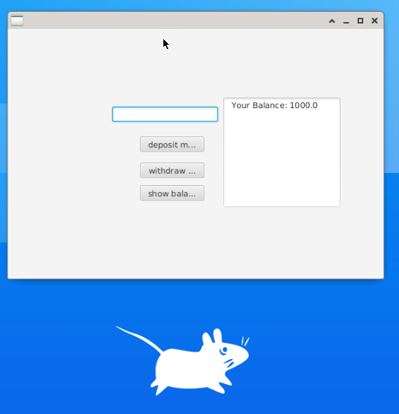

# Release 1 22.09.2022

---

# Beskrivelse

Release 1 inneholder dokumentasjon om første utgivelse av bank prosjektet.
I første utgave er det implementert enkle og viktige funkjsoner til en bank system. Disse funksjonene innbærer; å ha minst en bruker som kan ta inn eller ut penger og sjekke saldoen.

## GUI

Brukergrensesnittet er veldig enkelt i første omgang, vi fokuserer heller på koden er ordentlig gjennomført og at en app kjører og viser frem noe. GUI-en består av tre felt; et input felt som brukes for å skrive beløpet som skal settes inn i konten, eller tas ut av kontoen. Et output felt som viser brukerens saldo. Og tre rektangulære knapper, bestående av ulike handlinger som "deposit money", "withdraw money" og "show balance". Dersom brukeren prøver å sette inn eller ta ut et ugyldig beløp, skal en popup dukke opp og gi brukeren tilbakemelding om hva som har gått galt.

La oss se på et scenario for å forstå funksjonalitene i praksis: En bruker vil først se saldoen sin. Han trykker på "show balance" knappen, og ser på output feltet at han har 1000kr tilgjengelig. Deretter bestemmer brukeren seg for å sette inn litt penger. Brukeren skriver da inn en sum på 500kr i input feltet, og trykker deretter på "deposit money" knappen. Nå vil brukeren sjekke den nye saldoen og trykker igjen på "show balance" knappen, hvor det nå står 1500kr.

Bank systemet i realease 1 er bygd opp av tre klasser

- **[bank]:**: Denne klassen blir ikke brukt aktiv i første utgivelsen. Grunnen til dette er at bank systemet vårt støtter bare en konto. I neste utgivelsen skal flere brukere med en eller flere kontoer kunne bruke bank systemet. Da er det viktig at banken har oversikt over alle kundene sine.
- **[User]:** Denne klassen blir heller ikke brukt i første utgivelsen. Grunnen til det er også at bank systemet støtter bare en konto. I neste utgivelse skal en bruker kunne opprette flere kontoer. Da er det viktig at brukeren har oversikt over sine kontoer.
- **[Account]:** Denne klassen er den mest sentrale klassen for første utgivelse. Bank systemet støtter bare en konto til første utgivelsen. Brukeren kan sette inn penger i denne kontoen og ta ut penger fra denne kontoen. Brukeren kan også sjekke saldoen. I neste utgivelse skal brukeren kunne opprette flere kontoer som brukskonto, sparekonto osv. Da skal Account klassen fungere som en superklasse. Andre klasser kan da arve fra denne klassen. På den måten kan de andre kotoene gjennbruke metoden til superklassen.

# Gitpod

Repo for realease 1 er Gitpodifisert og kan Kompileres og kjøres med Maven.
