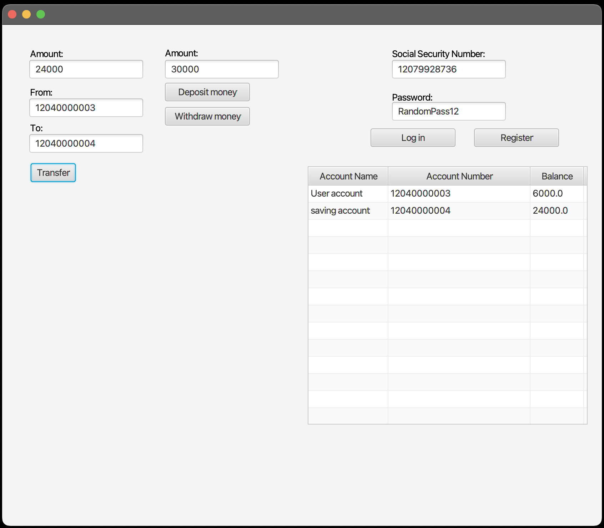

# Release 2, 13.10.2022

---

# Beskrivelse

Release 2 introduserer masse nye konsepter som er nødvendig for å sørge for bra, ryddig og forståelig kode (Checkstyle), at klassene er grundig testet (JaCoCo, ikke nytt men brukt til sitt fulle potensialet denne gang), og også at bugs ikke er utbredt i koden (Spotbugs); samt som den fullfører grunnklassene og funksjonalitetene så appen fungerer så-og-si som forestilt (mulig vi finner på å legge til ekstra funksjonaliteter i neste release, men det blir kun for det lille ekstra). Vi har ordnet et [klassediagram](./class-diagram.puml) (dette er kun puml koden, må åpnes i noe som støtter .puml, som f.eks. VSCode med riktig extension) som viser relasjonen mellom klassene til appen. Filbehandlingen har også blitt endret slik at nå tas JSON-lagring i bruk. Alt dette, inkludert klassene, forklares grundigere i punktene nedenfor. Også inkludert denne gangen er et klassediagram som ser slik ut

Programmet ser slik ut nå:

i motsetning til slik [tidligere](https://gitlab.stud.idi.ntnu.no/it1901/groups-2022/gr2258/gr2258/-/blob/master/Docs/release1/image.png). Feil input vil gi en alert som ser [slik ut](./Screenshot_GUI_F.png)

# Arbeidsvaner

Vi ble flinkere til å følge prinsippet om å lage kodingsoppgaver til enhver ting, men vi ordnet derimot ikke forskjellige greiner til enhver ting da vi fant fort ut at dette ble veldig lite praktisk, spesielt til de aller minste av kodingsoppgavene. Vi har vært flinke til å gruppere kodingsoppgaver til riktig milepæl, denne gang var milepælen "Release 2" for de aller fleste av kodingsoppgavene. Vi har jobbet i par og dermed følgt parprogrammeringsmålet, som bevist ved "co-author" ved en del av "commitene" denne utgaven (release 2). I tillegg har vi prøvd og fått til å følge SCRUM-prinsipper så godt som vi kan: vi har bl.a. hatt korte møter på 15 min hver mandag og onsdag, og ett fast lengre møte fysisk hver fredag, samt noen ekstra lengre fysisk ved behov. Spesielt ble det flere fysiske møter i release 2 pga. parprogrammering.

# Checkstyle

Vi er en gruppe på fire stykker, med forskjellig bakgrunn, og dermed forskjellige måter å kode på. Ved å implementere Checkstyle har vi opprettet en felles kodestandard som vi alle forholder oss til. Med dette slapp vi å måtte sjekke mange forskjellige ulikheter i koden manuelt, samtidig som at den fant design problemer i både klassene og metodene som vi fikk advarsel om å fikse. Vi benyttet oss av Googles Checkstyle som heter "Google Java Style"

# JaCoCo

Vi brukte JaCoCo allerede ved forrige release, men vi var litt uerfarne med det da. Ved å ta i bruk JaCoCo har vi sørget for at metodene til alle klassene er grundig testet, noe som er viktig for å vite at programmet kjører som den skal og at ikke det er noen sikkerhethull eller bugs som fører til diverse problemer. 

For å ordne en JaCoCo-rapport må man være i foreldremodulen til "bank" og "gui og kjøre mvn-kommandoen "mvn verify". Videre må man gå under target-mappen til barnemodulene, hvor man finner en mappe med navn "site", og under den finner man en HTML-fil som heter _index.html_ 

# Spotbugs

Spotbugs ble tatt i bruk for å sjekke for bugs i koden. Er ikke så mye å si om dette ellers, bortsett fra at det fungerer bra og er nyttig. Et problem vi hadde med Spotbugs var at den klagde på bruken av settere i eksterne klasser (). Den klagde ved endring av en klasse fra andre klasser, noe som er nødvendig for appen vår. Vi fikset dette ved å ordne en XML fil som ligger under her, for å ignorere feilmeldingen. Kodelinjen `<Bug pattern="EI_EXPOSE_REP2" />` fikset problemet.

# Filbehandling

I forrige release hadde vi filbehandlingsklassen _ReadAndWriteData.java_ som fungerte og gjorde det den skulle. I denne releasen skulle vi ta i bruk JSON, og dermed erstattet vi den klassen med JSON-mappen som ligger rett utenfor bank-mappen. Denne mappen inneholder en hel rekke med serializere og deserializere som altså skriver til og leser fra fil. Inne i den ytterste mappen, _gr2258_ ligger _bank.json_ som inneholder (om ikke tom) brukere med informasjon om balanse, kontonumre o.l. som kan også legges til ved registrering

# Grunnklasser og GUI

Som følge av modularisering ble det ordnet to mapper (core og gui) hvor vi separerte GUI-filene (view- og controllerfilene) fra model-klassene. Mer om modulariseringen fins [her](https://gitlab.stud.idi.ntnu.no/it1901/groups-2022/gr2258/gr2258/-/blob/master/readme.md)

Angående klassene vi har nå; i core-mappen finner vi klassene:
- **_Account.java_**:       
Funksjonaliteten er som før - den holder styr på balanse, kontonummer og tar ut/inn penger. Det som er nytt er at den er nå satt som en superklasse som kan bli utvidet av andre klasser, som vi skal se på snart
- **_Bank.java_**:     
Denne klassen har fått inn nye metoder som skal gjøre det mulig å overføre fra en konto til en annen (så lenge en er logget inn), metoder for å registrere seg og å logge inn. Med disse følger det noen get- og set-metoder, samt valideringsmetoder. 
- **_SavingAccount.java_**:
Denne klassen er ny, og utvider superklassen _Account.java_. Hensikten med denne klassen er som navnet tilsier - sparekonto. 
Klassen initierer en konto av typen sparekonto. Har metoder for å øke saldoen med en viss rentesats for et gitt tidsintervall. Akkurat nå har vi ikke greid å fått det til å fungere da vi ikke har fått det til å fungere med JSON, men dette blir en oppgave for Release 3. Som mange andre sparekonti, er det en grense på antall uttak, dette har blitt tatt hensyn til, og det er implementert metoder for det
- **_User.java_**:
Mye nytt i denne klassen. I release 1 eksisterte klassen, men ble ikke tatt i bruk da vi brukte kun én enkel konto for å ta ut/inn penger, og hadde ingen funksjonalitet for overføring av penger eller å logge inn/registrere ny bruker. En instans av _User.java_ tar inn et gyldig fødsels- og personnummer (11 siffer), et passord som stemmer med brukerens passord, eller er et gyldig passord for en ny bruker. Å registrere en bruker fører til at brukeren får to konti: en brukskonto og en sparekonto - begge med forskjellige kontonumre.

Filene (klasser og FXML-filer) som vi finner i gui-mappen er:
- **_BankApp.java_**:
Denne skal aldri bli endret, og ble heller ikke endret fra Release 1 til nå, da den skal kunne kjøre programmet og vise det.
- **_BankController.java_**:
En del endringer har skjedd i kontrolleren som følge av de nye funksjonalitene - nye metoder i kontrolleren for overføringer, innlogging og registrering, og også en "refresh"-metode som sørger for at Tableviewen blir oppdatert etter overføringer og endringer i balansen. Bruk av JSON til filbehandling har ført til erstatning av de gamle metodene for lesing og skriving til fil. 
- **_BankApp.fxml_**:
Har lagt til nye knapper og tekstfelt for registrering, innlogging, og overføring av penger. Flyttet litt på knapper og tekstfelt.
