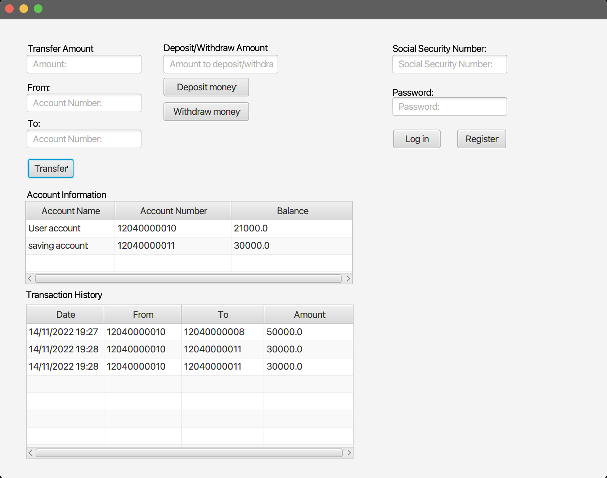

# Release 3, 14.11.2022

---

## Beskrivelse

Release 3 introduserer noen nye viktige konsepter som f.eks. bruken av Springboot for å bygge REST-API, og videreutvikling av appen ved å legge til funksjonalitet for transaksjoner mellom forskjellige kontoer. Vi har justert på koden for å sørge for at vi får riktige og detaljerte feilmeldinger, og vært nøye med Checkstyle og sørget for å ha bra kode. Vi har ordnet flere diagrammer, blitt enda flinkere og effektive med arbeidet gjennom gode arbeidsvaner, og levert et sluttprodukt som vi er fornøyde med.

## Utseende
Slik ser programmet ut nå 

## Arbeidsvaner
Vi har blitt enda flinkere til å lage utviklingsoppgaver (issues) til alt som vi bedømte være verdig det. Igjen så ordnet ikke vi nye git-greiner til absolutt alt, da noen av oppgavene var enkle småfikser. Vi ordnet nye tagger som kategoriserte på en mer informativ måte hva utviklingsoppgaven handlet om, f.eks. "bug" til noe som ikke virket som det skulle for en uvisst grunn, og "rest" for alt med REST-API.

Vi benyttet oss igjen av par-programmering da vi syntes det både fungerte bra på siste release da vi ble introdusert til det, og også siden at vi fant ut å være to stykker på en oppgave førte til mer effektivitet.

Vi fortsatte med å følge SCRUM-prinsipper som vi ble kjent med tidlig i semesteret og forbeholdt de korte møtene på mandager og onsdager, samtidig som vi møttes fysisk hver fredag, og også en ekstra gang her-og-der ved behov, da å jobbe fysisk sammen var mer effektivt ved visse oppgaver.

Vi fordelte oppgaver på en måte som både sørget for å passe hvert individs styrker samtidig som vi prøvde i stor grad å gjøre slik at alle fikk gjort ivertfall litt av hvert. 

## Diagrammer
Vi har ordnet tre diagrammer for å vise de viktigste delene av systemet, løsningen og ikke minst for å vise til koblingen mellom brukerinteraksjon og hva som skjer inne i systemet, inkludert et REST-kall. Disse er beskrevet av henholdsvis [klassediagrammet](Klasse.png), [pakkediagrammet](pakke.png) og [sekvensdiagrammet](sekvens.png).

## REST-API
Vi har brukt Spring Boot til å bygge REST-API. Slik at programmet vårt skal kunne kommunisere med en server ved å sende HTTP forespørsler. i prosjektet vårt har vi brukt metodene:        
 - <code>GET</code>: til å hente eksisterende data fra serveren. Eksempel: hente data til en bruker   
 - <code>PUT</code>: til å oppdatere eksisterende data. Eksempel: ved innsetting av penger   
 - <code>POST</code>: til å legge til ny brukere. Eksempel: ved å legge til nye brukere.   
 - <code>DELETE</code>: til å slette eksisterende data. Eksempel: slette en bruker fra databasen. Foreløpig bruker vi <code>DELETE</code> kun til testing.     

En detaljert beskrivelse av disse metodene finnes [her](rest-api.md).

## Jpackage & Jlink
Vi implementerte Jpackage og Jlink for å gjøre programmet "shippable", altså slik at kunder o.l. kan installere det og kjøre det selv. Vi har kommet borti problemer når det gjelder å kjøre appen på Mac: står at filen er [skadet](feilmeldingJpackage.png) ved kjøring av det på Mac. Vi har hørt med studass og teknisk hjelp, og heller ikke de visste hvorfor. Funker derimot på Windows.

## Grunnklasser, GUI og testing
### *Core*:
De fire grunnklassene i core-mappen som var der fra release 2 har fått noen nye småe forbedringer i kode, metoder for å støtte GUI-implementasjoner som f.eks å vise pengemengder med maks to desimaler, men alt-i-alt ikke mye nytt har skjedd her. Det nye store tillegget derimot er klassen Transaction.java som gir programmet en funksjonalitet for å kunne se transaksjonsloggen; den viser dato, konto overført fra og til, samt beløp. 

### *GUI*:
Ingen nye endringer i BankApp.java, som i release 2, da den skal kun kjøre appen. De to resterende klassene derimot--BankController.java og BankApp.fxml--har fått et par nye endringer som nye metoder og felt for å implementere funksjonaliteten i Transaction.java, GUI-forbedringer som f.eks fjerning av input etter en handling, maks to desimaler på pengemengder og endring i utseende og mer.

### *Rest*:
Som nevnt oppe brukte vi Spring Boot for å implementere REST-API. For å gjøre dette måtte vi ordne en ny mappe, og dermed er programmet delt i tre deler, nå med en mappe "rest" som følger med "core" og "gui". I rest-mappen finner en klassene BankSerice.java, SpringApp.java og SpringController.java; alle de sørger for at appen kjøres og responderer til REST-forespørslene på en riktig måte. Har også skrevet tester for de i test-mappen innen rest-mappen - SpringAppTest.java og SpringbootAppTest.java utgjør de.

### *Testing*:
Når det gjelder testing så har vi sørget for at alt er testet, noe som vi også gjorde i forrige release, og dermed er det ikke mye nytt, bortsett fra tester for den nye Transaction.java-klassen og tester for Spring Boot. Vi har testet Transaction.java med vanlig JUnit, mens testene til Spring Boot er gjort med Mockmvc. Med Mockmvc så Mocker vi en server og sender forespørsler til serveren uten å måtte starte den egentlige serveren programmet kommuniserer med. Samtidig har vi gått fra å lagre data lokalt til å gjøre det til en remote server, noe som gjør at testene til bank-kontrolleren er avhengig av at serveren er startet før testene blir kjørt. I tillegg til å teste bank-kontrolleren ved å snakke direkte til serveren har vi brukt Wiremock til å mocke aksessring av data fra serveren.    
