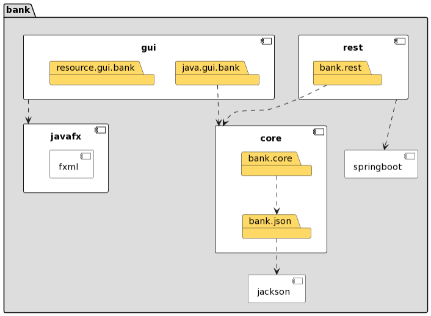
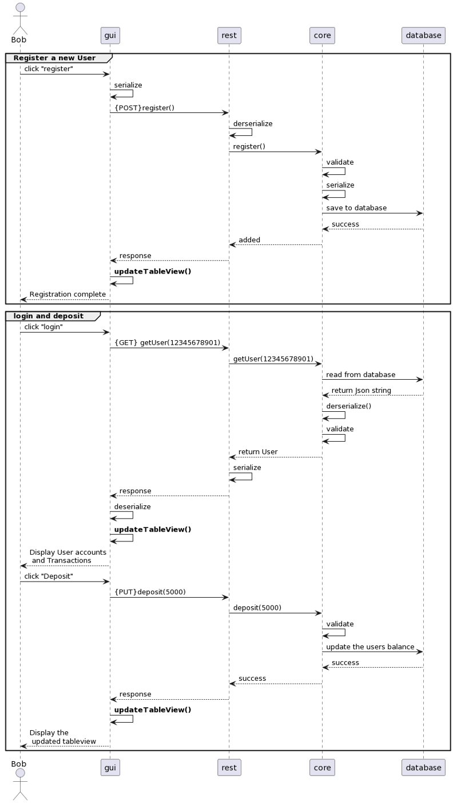

# Bank App  

Dette prosjektet går ut på å uvikle en enkel bank app, som har noen enkle og viktig funksjoner til en banksystem.
Banken vil ha følgende funksjoner:

1. Registrere en bruker med Social security number (SSN) og passord, deretter lagre brukeren i banken med to forskjellig kontoer. En vanlig brukskonto og en sparekonto med rente.
2. En registrert bruker kan logge inn og få informasjon om kontoene sine, som saldo.
3. En registrert bruker kan overføre penger mellom egne og andre kontoer. Det skal være mulig å se hvilke transaksjoner som er blitt gjort.
4. All informasjon vil være lagret i skyen, har banken forbindelse til og som kan lese og skrive informasjon til.

___

## Struktur og maven

Dette prosjektet innebærer også tester for de ulike modulene, og sikter på et meget høy testdekningsbidrag.

Prosjektet er konfiguert i moduler og bygges med maven.

* I "core" mappen er domenelogikken og serialiseringen, den lokale lagringen.
* Mappen "gui" finner man brukergrensesnitt (JavaFX-GUI)
* I "rest" handler det om persistens. Det inkluderer server og API endpoint ved  bruk av springboot.

___

## Kodekvalitet

Vi bruker ulike kodekvalitets-verktøy for å sikre god kode.

* Checkstyle brukes for å sjekke om Java-kildekoden er kompitabel med spesifiserte kodingsregler
  * Det er mulig å få opp en rapport i form av en .html fil og i terminalen.

___

* JaCoCo brukes for å sjekke testdekningsbidrag
  * Det er mulig å få opp en rapport i form av en .html fil og i terminalen

___

* Spotbugs brukes for å finne eventuelle bugs
  * Builden vil stoppe opp hvis en bug er funnet.

  ___

## Illutrasjoner

Under er to skjermbilder av hvordan brukergrensesnittet ser ut.

Slik ser UI-et før man har registrert seg eller logget inn

Slik ser UI-et etter man har logget inn, og gjennomført en transaksjon fra "user account" til "saving account"

  ___

## Diagrammer

### Pakkediagram

___

### Klassediagram

### Sekvensdiagram

